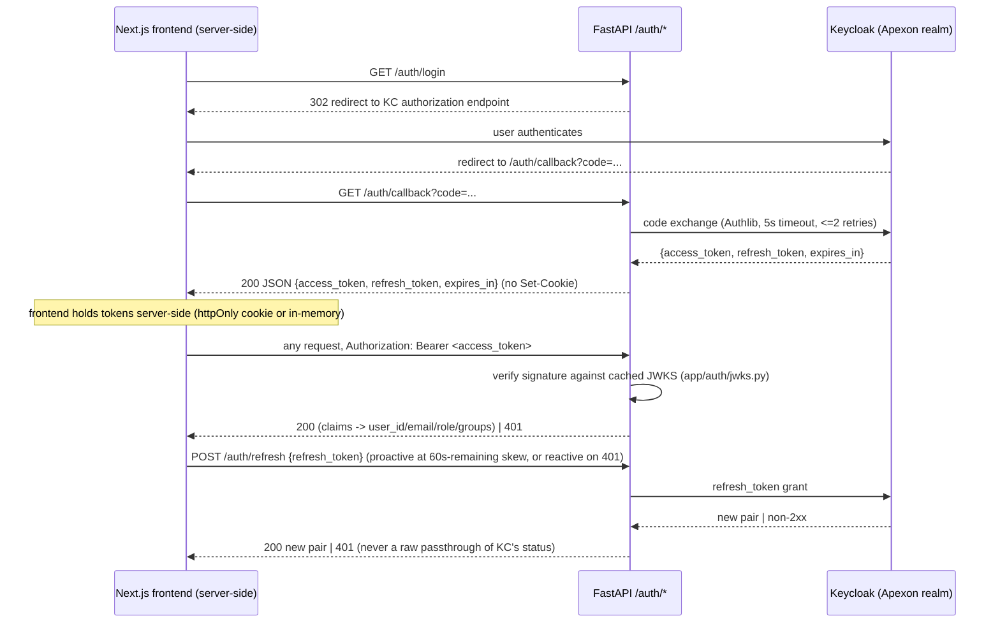

# AUTH-01 — Data Design

State & data management. Each concern is specified or marked `N/A — <reason>`.

## 1. Data model

No new durable entity. Session state is derived per-request from the validated JWT and never persisted (bearer-JWT bridging, stateless — `docs/requirements/auth.md` § session). The existing `user_roles` table (`app/models/ingestion.py`, `UserRole`) is a separate reference/cache table synced by ING-08; AUTH-01 reads no rows from it and writes none.

## 2. Migrations

N/A — no schema change. No table, column, or index is added or altered by this story.

## 3. Ownership & tenancy

N/A — AUTH-01 creates no owned resource. `/auth/*` is the trust-boundary entry point itself (issues/validates identity), not a per-resource endpoint subject to `_load_owned`-style scoping. Per-resource ownership/RBAC enforcement begins at AUTH-03 (`docs/requirements/auth.md` § rbac-checks), which consumes this story's `role`/`groups` output.

## 4. Data classification & retention

- `oidc_client_secret` — sensitive; env-sourced only (`Settings`), never a literal in code or `.env.example` (placeholder value only).
- `access_token` / `refresh_token` — sensitive; never persisted server-side (FastAPI), never logged in any form (AUTH-01-NFR-security). Frontend-side retention/lifetime is out of this story's scope (session contract, frontend-owned store).
- `email` — PII; present in JWT claims and in the derived session object, but never logged — only `user_id` is logged, per `.claude/rules/security-baseline.md` and AUTH-01-FR-10.
- No durable retention/deletion policy applies — nothing durable is written by this story.

## 5. Consistency & concurrency

- JWKS cache (`app/auth/jwks.py`) is the only shared mutable state: an `asyncio.Lock`-guarded fetch-once path serializes concurrent cache-miss requests so a burst of requests with an unrecognized `kid` triggers exactly one fresh JWKS fetch, not a stampede (D-04).
- Outbound Keycloak calls (code exchange, refresh, JWKS fetch) are not idempotent by nature (an authorization `code` is single-use at Keycloak's side); this story adds no compensating idempotency-key logic — a retried code exchange fails on Keycloak's side with its own error, surfaced as this story's standard error mapping (501/401), not specially handled here.
- Delivery/ordering semantics: N/A — synchronous request/response only, no async messaging (see § 10).

## 6. Caching

- **JWKS key cache** — key: `kid`; TTL: 3600s; invalidating event: a signature-verification failure against the cached key set for an unrecognized `kid` triggers exactly one fresh fetch before the request fails (not a fixed-interval background refresh) (D-04, AUTH-01-NFR-performance).
- Cache is in-process (a single-instance in-memory dict), not distributed — if the API runs multi-instance, each instance maintains its own cache independently; this is an accepted characteristic of the fetch-once-per-unrecognized-kid design, not a defect (each instance still converges to a correct key set on its own next miss).
- No other cache is introduced.

## 7. Ephemeral / session state

- The bearer JWT itself is the ephemeral session artifact. FastAPI never stores it — it validates per request and returns derived claims. The frontend (Next.js) is the sole holder, server-side, in a Route Handler/server-action-owned store (httpOnly cookie scoped to its own origin, or in-memory on the Node server) — never `localStorage`, per the session contract's `frontend_storage` field.
- The JWKS cache (§ 6) is process-local ephemeral state, not request-scoped and not distributed.
- No FastAPI-side cookie, CSRF token, or server-held per-connection state is introduced by this story.

## 8. Query-path & access-path performance

- No database queries are introduced by this story — no N+1 concern.
- Per-request JWT verification cost is the performance-critical path: budget <10ms with a warm JWKS cache, <100ms on a cold/uncached fetch (AUTH-01-NFR-performance).
- Every outbound Keycloak HTTP call (code exchange, refresh, JWKS fetch) carries a 5s explicit timeout; transient failures retry at most 2 times with exponential backoff + jitter (base 250ms); a 4xx response from Keycloak never retries (performance-baseline.md "I/O has explicit timeouts" + "bounded retry").

## 9. Contract (API / interface)

Contract: session → `docs/requirements/auth.md#session` (produced by this story; consumed by AUTH-02, AUTH-03, AUTH-04, SHP-01, SHP-02, SHP-03 — concrete shape authored there per plan step 10, not duplicated here).

Feature-internal route table (implementation detail behind the contract above, no other story wires these routes directly):

| Method | Path | Auth | Response |
|---|---|---|---|
| GET | `/auth/login` | none | 302 redirect to Keycloak authorization endpoint, or 501 if OIDC config incomplete |
| GET | `/auth/callback` | none (carries `code`, `state`) | 200 `{access_token, refresh_token, expires_in}`, or 501 if OIDC config incomplete |
| POST | `/auth/refresh` | none (carries `refresh_token` in body) | 200 new `{access_token, refresh_token, expires_in}`, or 401 on any IdP-reported failure |
| POST | `/auth/dev-bypass` | none — route itself only exists when registered | 200 `{access_token, refresh_token, expires_in}`; router unregistered (404) unless `settings.environment` is allow-listed |

## 10. Async & messaging

N/A — purely synchronous request/response. No queue, topic, or scheduled job is introduced by this story.
