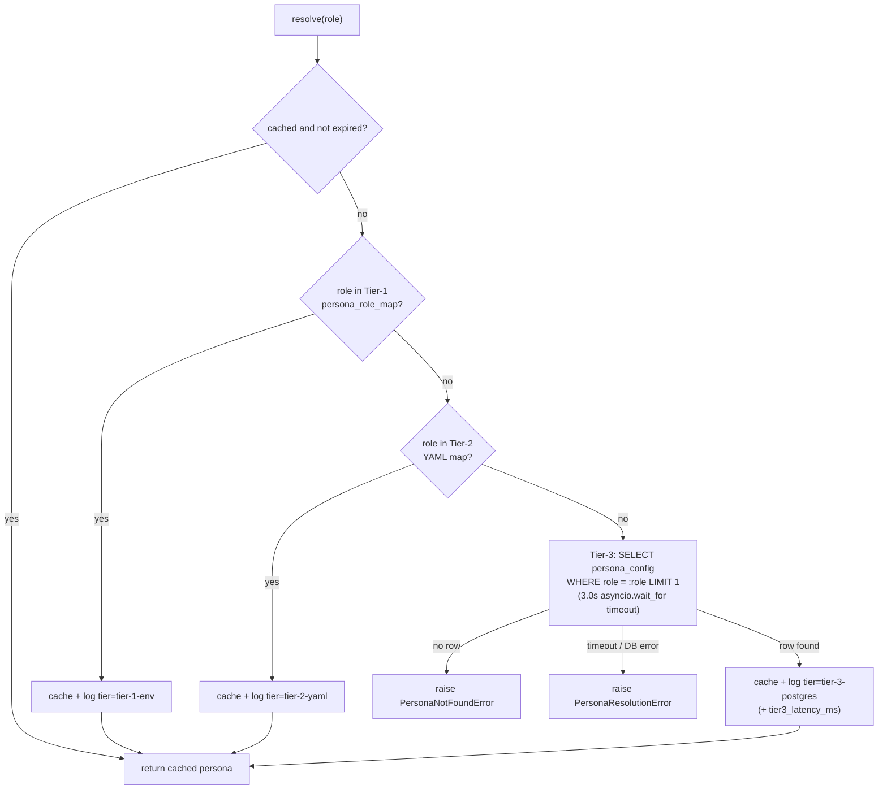

# AUTH-02 — Data Design

State & data management. Each concern is specified or marked `N/A — <reason>`.

## 1. Data model

No new durable entity. This story reads (never writes) the existing `persona_config` table shipped by BED-01 (`docs/requirements/data.md` § db-schema, `app/models/ingestion.py::PersonaConfig`). Tier-1 (env-JSON) and Tier-2 (YAML file) are configuration, not application data — role→persona slug pairs, no user identifiers.

### `persona_config` (postgres table, existing — BED-01, read-only from this story)

| Field | Type | Key/Constraint | Class | Notes |
|---|---|---|---|---|
| role | String | PK | — | role slug (e.g. `cio`, `board_member`); no fixed enum, fully data-driven |
| persona | String | not null | — | typically one of `cio`\|`architect`\|`developer`\|`product-manager`\|`engineering-manager`, but stored/read verbatim — no app-level enum constraint |

## 2. Migrations

N/A — no schema change. `persona_config` already exists via BED-01's `migrations/versions/001_initial_schema.py`; this story adds no column, index, or table.

## 3. Ownership & tenancy

N/A — `persona_config` is a global, ops-managed role→persona map with no `user_id`/`tenant_id` scoping column; it is not a per-resource entity subject to `_load_owned`-style enforcement. Tier-1/Tier-2 sources are likewise global (env var / one YAML file per deployment), not per-user.

## 4. Data classification & retention

- `role` / `persona` values (across all 3 tiers) are org-level configuration slugs — not PII, not sensitive. `PERSONA_ROLE_MAP` env content and the Tier-2 YAML file carry no user identifiers.
- No retention/deletion policy applies — this story performs no writes to `persona_config`; BED-01 owns its lifecycle.
- Log events (`persona_mapping_loaded`) carry `{role, persona, tier, timestamp}` only — no PII, per FR-5 and `.claude/rules/security-baseline.md`.

## 5. Consistency & concurrency

- Tier-3 is a single-row PK point read; this story performs no writes, so no write-conflict/transaction-boundary concern exists.
- `PersonaResolver`'s per-role cache read+miss+write critical section is guarded by a single `asyncio.Lock` (D-04): N concurrent `resolve()` calls for the same cold role collapse to exactly one Tier-3 query (`AUTH-02-TC-14`).
- No idempotency key needed — `resolve()` is a pure read with no side effect beyond the in-process cache and a log line.
- Delivery/ordering semantics: N/A — synchronous in-process async calls only, no distributed/multi-store concern.

## 6. Caching

- **Per-role persona cache** — key: `role`; TTL: 300s (5 min); invalidating event: TTL expiry only (no explicit invalidation endpoint — deferred, `REQUIREMENTS.md` § Out of scope). Per-worker/per-process (Uvicorn multi-process model): each worker independently converges to a Postgres-sourced value within 300s of any Tier-3 row change; ops-level hard refresh = process restart (documented in `services/api/README.md`, T-10).
- No other cache is introduced. Tier-1/Tier-2 sources are loaded once (Settings load / `PersonaResolver.__init__`) and held in memory for the process lifetime — not re-read per call, and not separately TTL'd (the per-role cache above already gates re-consultation of all 3 tiers uniformly).

## 7. Ephemeral / session state

- The per-role cache dict (`PersonaResolver._cache`) is the ephemeral state this story introduces: non-durable, in-process, worker-lifetime-scoped (bounded by each entry's own 300s TTL), lost on restart.
- No client/browser-held state — this is a backend-only library with no UI surface (`REQUIREMENTS.md` § Visual spec: N/A).

## 8. Query-path & access-path performance

- Tier-3 query is a single PK point lookup (`WHERE role = :role LIMIT 1` against `persona_config.role`, the primary key) — no join, no table scan, no fan-out.
- Explicit 3.0s `asyncio.wait_for` timeout on the Tier-3 query (`.claude/rules/performance-baseline.md` "I/O has explicit timeouts").
- Warm cache hit budget: <1ms p99 (O(1) dict lookup, no I/O — `AUTH-02-TC-12`). Cold Tier-3 hit budget: <100ms p95 (`AUTH-02-TC-13`).
- No pagination concern — `resolve()` returns a single scalar value per call, not a list.

## 9. Contract (API / interface)

Contract: persona-resolver → `docs/requirements/auth.md#persona-resolver` (produced by this story; concrete shape authored there per plan step 10, not duplicated here). No HTTP route — a pure Python async interface (`app.state.persona_resolver.resolve(role: str) -> str`) consumed in-process by AUTH-03 and SHP-01.

## 10. Async & messaging

N/A — purely synchronous (in the sense of a directly-awaited async function call). No queue, topic, or scheduled job is introduced by this story.
