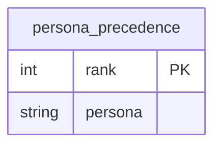

# AUTH-07 — Data Design

State & data management for session identity, app-wide logout, and deterministic persona resolution.
Each concern is specified or marked `N/A — <reason>`.

## 1. Data model

### `persona_precedence` (Postgres table, new — table #20)

| Field | Type | Key/Constraint | Class | Notes |
|---|---|---|---|---|
| rank | int | PK | — | 0 = highest priority; ties are not modeled (one row per rank) |
| persona | str | not null | — | one of `cio \| architect \| product-manager \| engineering-manager \| developer`, but the table is data-driven — any string an operator writes is honored verbatim, mirroring `persona_config`'s own no-hardcoded-enum stance |

No other table changes. `persona_config` (existing, Tier-3 for role→persona mapping) is untouched — see
ADR-0011 for why precedence is a separate table rather than a new column there.

## 2. Migrations

Forward: `services/api/migrations/versions/005_persona_precedence.py` — `op.create_table("persona_precedence", ...)` with a `rank` integer primary key and a `persona` not-null string column, mirroring `003_program_roster.py`'s additive-only shape. Downgrade: `op.drop_table("persona_precedence")` (no dependent objects). No data backfill — an empty table is a legitimate steady state; the resolver's precedence lookup falls through to the hardcoded default order `["cio", "architect", "product-manager", "engineering-manager", "developer"]` when Tier-3 returns zero rows, exactly as Tier-1/Tier-2 unset already does. Zero-downtime: pure additive `CREATE TABLE`, no lock on any existing table, safe to run against a live database with no ordering constraint against other migrations beyond depending on `004_rollup_query_indexes` (the current head).

## 3. Ownership & tenancy

N/A — `persona_precedence` is a single, global, org-wide ranking with no per-user, per-program, or per-tenant scope (same as `persona_config`). There is no owning user/resource to enforce a 404-not-403 style check against; the table is read-only from the running application's perspective (an operator writes rows out-of-band via SQL/migration/a future admin surface, out of this story's scope).

## 4. Data classification & retention

No PII. Retention: indefinite, same lifecycle as `persona_config` — this is operator-authored configuration, not user data, so no deletion/soft-delete semantics apply. No encryption-at-rest beyond the database's existing standard (no column here is sensitive).

## 5. Consistency & concurrency

Single `SELECT rank, persona FROM persona_precedence ORDER BY rank` per cache-miss, no write path from the application (writes are an operator/ops action, out of scope). No concurrent-write contention to serialize. Read is bounded by the resolver's existing 3.0s `asyncio.wait_for` timeout (the same budget `persona_config`'s Tier-3 lookup already uses — no new timeout value introduced).

## 6. Caching

Precedence order is cached in-process for 300s, reusing `PersonaResolver`'s existing TTL/`asyncio.Lock`-guarded read-miss-write pattern (per-role cache dict), stored under a dedicated sentinel key that can never collide with a real role string (e.g. a reserved constant, not user input). Invalidating event: TTL expiry only, per worker/process — identical semantics to `persona_mapping_loaded`'s existing cache and to `program_membership_source`'s roster cache (auth.md#session). An operator's Tier-3 precedence edit becomes visible to an already-warm worker only after its own next 300s expiry, or immediately on an app restart — the same operational lever `program_roster` re-pushes already document. No push-invalidation; not owned by this story to add one.

## 7. Ephemeral / session state

N/A — backend/API-only story; no client-side ephemeral state is introduced. (The frontend's `/logout` Route Handler reads the EXISTING `dashboard_session` httpOnly cookie via `tokenStore.ts`, already documented under AUTH-05/AUTH-01; this story adds no new cookie or client store.)

## 8. Query-path & access-path performance

`persona_precedence` is bounded in size (one row per configured persona, realistically ≤10) — no pagination, no index beyond the `rank` primary key is needed. The per-role tier lookups this story extends (Tier-1 env dict, Tier-2 YAML dict) are in-memory, O(1) dict lookups; the multi-role precedence pass (D-06) iterates the surviving-role list (bounded by the number of roles a single token carries, realistically ≤5) doing casefolded in-memory comparisons — no N+1 query risk, since the ONLY I/O-bearing lookup (Tier-3 Postgres) is cached at 300s per role and per precedence-order-as-a-whole (§6), not re-queried per candidate role on every request.

## 9. Contract (API / interface)

All three of this story's produced/extended interfaces are registered cross-story contracts — authored
in full at `docs/requirements/{auth,api}.md` (filled to their concrete plan-time shape by this same
planning pass), not re-authored here:

- Contract: `session-identity-api` → `docs/requirements/api.md#session-identity-api` (`GET /api/me`)
- Contract: `session` → `docs/requirements/auth.md#session` (`logout_note` — `GET /auth/logout` +
  `apps/web/src/app/logout/route.ts`; `display_name_note`/`role_selection_note` — `CurrentUser.name`/
  `.roles` additive fields)
- Contract: `persona-resolver` → `docs/requirements/auth.md#persona-resolver` (`case_insensitivity_note`/
  `deterministic_selection_note`/`unmapped_role_observability_note`)

No feature-internal (unregistered) interface exists in this story beyond the two above.

## 10. Async & messaging

N/A — purely synchronous request/response paths (HTTP routes, in-process cache, one bounded Postgres
query per cache miss). No queue, topic, or scheduled job is introduced.
