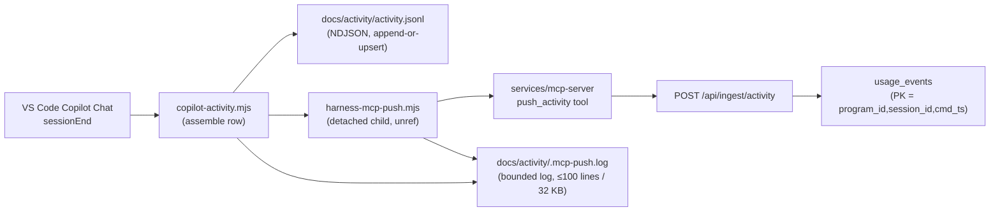

# ING-05 — Data Design

State & data management for the Copilot Chat activity-hook bridge. Each concern is specified or marked `N/A — <reason>`.

## 1. Data model

The feature owns NO durable database schema — every write path lands in local NDJSON / log files on the developer's laptop. The frozen `usage_events` row (destination of ingested rows) is owned by ING-02 (`services/api/app/models/usage_event.py`) and its unique constraint `(program_id, session_id, cmd_ts)` is the PK ING-05 rows must align with.

### `activity.jsonl` row (append-or-upsert on `(session_id, cmd_ts)`)

| Field | Type | Key/Constraint | Class | Notes |
|---|---|---|---|---|
| `program_id` | string | required per row (ING-05-FR-1 / ADR-0015) | — | env → `.harness/program.yaml`; skip on unresolved |
| `ts` | ISO-8601 string | required | — | server-received timestamp; equals `cmd_ts` for hook writes |
| `cmd_ts` | ISO-8601 string | required; part of upsert key | — | command timestamp |
| `user` | string | required | **PII** | `git config user.email`, lowercased; never logged to `.mcp-push.log` per NFR-Security |
| `session_id` | string | required; part of upsert key | — | Copilot Chat session UUID from `chatSessions/<uuid>.jsonl` |
| `command` | string | required | — | leading `/<name>` extracted from the transcript's most-recent user.message |
| `duration_seconds` | int (alias `duration_s`) | required | — | cmd_ts → last transcript event, seconds |
| `outcome` | string | required | — | `completed \| error \| aborted` |
| `total` | int | required | — | `input_tokens + output_tokens` |
| `kind` | string \| null | nullable | — | literal `"command"` for Copilot rows |
| `feature` | string \| null | nullable (ING-05-FR-4) | — | parsed via `^/\S+\s+([A-Z]{2,4}-\d+)\b` — bare-token positional only |
| `intervention_count` | int \| null | nullable | — | user.message events strictly after cmd_ts |
| `files_created`/`files_modified` | int \| null | nullable | — | reconstructed from tool.execution_start events |
| `lines_added` | int \| null | nullable | — | heuristic diff-line estimate (research R-05 accepted) |
| `tool_rejections` | int \| null | nullable | — | tool.execution_complete with success==false |
| `input_tokens`/`output_tokens` | int \| null (aliases `input_token`/`output_token`) | nullable | — | summed across per-command journal `requests[]` |
| `cache_read_tokens`/`cache_write_tokens` | int \| null (aliases `cache_read`/`cache_write`) | nullable, emitted as **literal `0`** (ING-05-FR-3) | — | Copilot journal does not split cache tokens |
| `models` | object \| null | nullable | — | per-model breakdown `{modelId → {input,output,credits,...}}` |
| `source` | string \| null | nullable | — | literal `"copilot"` (differentiates from `harness-activity.mjs` rows) |
| `copilot_credits` | decimal \| null | nullable | — | rounded to 3dp |

### `.mcp-push.log` line

One-per-session-end append. Bounded (see §6). Line shape: `{"event": <name>, "ts": <iso8601>, ...allowlisted-fields}`.

| Field | Type | Key/Constraint | Class | Notes |
|---|---|---|---|---|
| `event` | string | required; enum | — | `success \| http_error \| timeout \| network_error \| program_id_unresolved \| journal_codec_unknown_kind \| mcp_url_non_loopback` |
| `ts` | ISO-8601 string | required | — | write timestamp |
| `http_status` | int | optional (http_error) | — | 4xx/5xx code |
| `error_code` | string | optional (network_error) | — | e.g. `ECONNREFUSED`, `ENOTFOUND` |
| `duration_ms` | int | optional | — | wall-clock of the failing RPC |
| `mcp_url_host` | string | optional | — | host portion of `HARNESS_MCP_URL` (loopback only, per NFR-Security) |

Field allowlist enforced (allowlist diff, not denylist). **Forbidden fields**: `user_email`, `command_text`, `journal_contents`, `program_id`, `bearer_token`, `Authorization` — see ING-05-NFR-security.

## 2. Migrations

N/A — no relational schema owned by this feature. The `usage_events` destination table's schema is frozen upstream (ING-02); `activity.jsonl` and `.mcp-push.log` are local append-mode files with no formal schema-versioning mechanism. Forward-compat for the journal codec is handled at read time via `JOURNAL_CODEC_VERSION = "1"` (D-01) — unknown-kind records skipped with a single log-line emit, no batch abort.

## 3. Ownership & tenancy

`activity.jsonl` and `.mcp-push.log` are per-developer, per-workspace files under `docs/activity/` (the workspace root the hook is invoked against). No multi-tenant boundary at the file tier — the row-level `program_id` (ADR-0015) is the enforcement mechanism for cross-program attribution downstream at the `usage_events` PK. The hook has no auth surface (no bearer token read, no user impersonation) — enforcement of who-can-write-what is at the OS filesystem layer only.

## 4. Data classification & retention

- **PII field** in `activity.jsonl`: `user` (git email, per `.claude/rules/security-baseline.md`). Present on every row. Rows land in `usage_events` which is subject to the backend's retention policy (out of scope for ING-05).
- `.mcp-push.log` MUST NOT log `user`, `program_id`, command text, journal contents, or the bearer token — enforced by field allowlist (§1 log-line row).
- Retention: `activity.jsonl` is append-mode, unbounded on the local disk (harness convention — reruns replace rows via `(session_id, cmd_ts)` upsert, so the file grows one line per unique command). `.mcp-push.log` is bounded — see §6.

## 5. Consistency & concurrency

- `activity.jsonl` write is a full-file rewrite (`writeFileSync(outPath, out.join("\n") + "\n")`), not an atomic append. Two concurrent hook fires from different Copilot Chat windows on the same workspace could race; the harness accepts the last-writer-wins outcome (matches shipped `harness-activity.mjs` behaviour). Upsert key is `(session_id, cmd_ts)` and matches the `usage_events` PK.
- `.mcp-push.log` is append-only via `appendFileSync` for happy-path writes; the log rotator (D-04 / §6) reads-truncate-rewrites in a single sync pass at the write boundary. No cross-process lock.
- MCP push RPC ordering is sequential inside `harness-mcp-push.mjs` (`initialize` → `notifications/initialized` → `tools/call push_activity` → `DELETE`); single-attempt discipline (D-02) forbids retry, so at-least-once semantics live one hop upstream at `services/mcp-server/`'s bounded retry over its own POST.

## 6. Caching

`.mcp-push.log` bounded cap:

- Hard caps: **100 lines AND 32 KB**. Whichever cap is hit first triggers a truncate-and-rewrite that keeps the tail (the most recent lines that fit under both caps).
- Rotation happens at write time, in-process — no external cron, no logrotate.
- Trigger: every `appendFileSync` call from either hook first checks the current file length (bytes) and line count; if either would exceed the cap after this write, the rotator reads the file, drops the head N lines, and writes the tail plus the new line back.
- Invalidation: N/A — the log is not a source-of-truth cache; it is an observability tail. Rotation is loss-of-history-by-design.

## 7. Ephemeral / session state

The detached child process (`harness-mcp-push.mjs`) holds one in-flight `AbortController` for the current RPC and a captured `Mcp-Session-Id` header string across the four-call sequence. Both are process-local; nothing persists across process boundaries. The parent (`copilot-activity.mjs`) holds no state after `spawn(...).unref()` returns.

## 8. Query-path & access-path performance

- `activity.jsonl` read on hook entry: full-file read + parse into array + linear scan for upsert-match. File size grows linearly with unique `(session_id, cmd_ts)` pairs across the developer's history in this workspace; today the corpus is 16 rows (ING-02 baseline). At 10 000 rows a full parse still stays under the FR-1 2 s p95 budget on commodity SSDs — no pagination or indexing scheme is warranted at this scale.
- Journal replay is a single-pass line-by-line JSON.parse over two files (`chatSessions/<uuid>.jsonl` + `transcripts/<uuid>.jsonl`). Cost is linear in journal length; typical Copilot Chat sessions produce ≤ a few thousand lines.
- MCP RPC path is four sequential HTTP calls, each bounded by `TIMEOUT_MS = 10_000`. Total worst-case wall-clock is 40 s, entirely inside the detached child — never blocks the parent hook (AC-2). p95 healthy is < 500 ms end-to-end.
- `.mcp-push.log` rotation is O(file size / bytes-per-line) at write time — negligible at the 100-line / 32 KB cap.

## 9. Contract (API / interface)

- **Consumed contract (frozen upstream)**: `mcp-tools → push_activity` — bookmarked at `docs/requirements/api.md#mcp-tools` (produced by ING-04, tracker #303, ADR-0014). ING-05 is a pure client of this contract; no local re-statement here.
- **Consumed row-schema (frozen upstream)**: `ActivityRowIn` in `services/api/app/schemas/ingest_files.py` — required fields per §1 table are enforced at the ingest tier. ING-05 aligns row emission to this schema; no re-statement here.
- **Feature-internal interfaces** (no downstream consumer):
  - `.github/hooks/copilot-activity.mjs` — invoked by Copilot Chat `sessionEnd` config wiring (external to the repo, user-owned in their VS Code / hooks.json config); reads `stdin` JSON `{session_id?}` (best-effort, resolves via mtime scan when absent); writes to `docs/activity/activity.jsonl` and spawns `harness-mcp-push.mjs`.
  - `.github/hooks/harness-mcp-push.mjs` — invoked as a detached child of `copilot-activity.mjs`; reads `HARNESS_MCP_URL` and `HARNESS_PROGRAM_ID` env vars; writes to `docs/activity/.mcp-push.log`; exits with code 0 on all outcomes (AC-5).

## 10. Async & messaging

- **Message**: MCP `tools/call push_activity` — issued by `harness-mcp-push.mjs` against `HARNESS_MCP_URL` (default `http://127.0.0.1:3010/mcp`, IPv4 loopback).
- **Trigger**: `copilot-activity.mjs` finishes NDJSON write and calls `spawn(process.execPath, [pushScript], {detached: true, stdio: 'ignore'}).unref()`.
- **Delivery guarantee**: **at-most-once** — single attempt per RPC, no retry (D-02, ING-05-FR-5). At-least-once semantics live upstream inside `services/mcp-server/` (its own bounded 3-attempt retry over network failures on its own POST to `POST /api/ingest/activity`, per ING-04 D-05).
- **Retry + backoff**: none in this feature by design.
- **DLQ / poison-message policy**: none — a missed session-end stays missed. The developer's next successful session re-establishes the pipeline. Observable failure surface is `.mcp-push.log` (bounded, ≤ 100 lines / 32 KB).
- **Consumer dedup / idempotency key**: `(program_id, session_id, cmd_ts)` — enforced downstream by `usage_events`' unique constraint (ING-02). A re-fire from a manual re-run replaces the row via ON CONFLICT DO UPDATE.
- **Schedule / cron**: N/A — event-driven from Copilot Chat lifecycle only.
- **Produced-by / consumed-by**: produced by `.github/hooks/harness-mcp-push.mjs` (ING-05); consumed by `services/mcp-server/src/agentrise_mcp/tools/push_activity.py` (ING-04).
