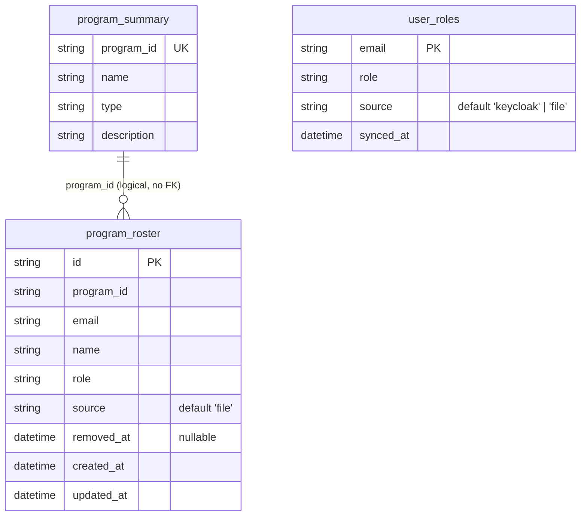

# ING-10 — Data Design

State & data management for `POST /api/ingest/manifest`. Each concern is specified or marked
`N/A — <reason>`.

## 1. Data model

### `program_roster` (postgres table, new — table #19, ADR-0010)

| Field | Type | Key/Constraint | Class | Notes |
|---|---|---|---|---|
| id | String | PK (uuid4 hex, matches every other model's `id` convention) | — | app-generated |
| program_id | String | unique(program_id, email) leading column | — | no FK — matches this codebase's existing convention of `program_id` as a bare string across every rollup table (BED-01), no cross-table FK anywhere in `db-schema` |
| email | String | unique(program_id, email); own `index(email)` (ADR-0010) | PII | one row per primary email AND per `aliases[]` entry |
| name | String | — | PII | shared by primary + all alias rows for the same member |
| role | String | — | — | the RAW roster slug as written in `.harness/program.yaml` (e.g. `dev`), NOT the long-form mapped role. Changed 2026-09-08 per AF-13 so this column matches the Product-Gate-approved test case TC-01 / tracker #241. `user_roles.role` still stores the long-form mapped value (`developer`) — the two columns deliberately differ. `map_role_slug()` is still applied during ingest, because a slug that maps to nothing is a row-level rejection; its result simply no longer lands here. AUTH-06 is unaffected: its read pattern selects only `program_id`, never `role`. |
| source | String | default `'file'` | — | distinguishes this writer from any future non-file writer |
| removed_at | DateTime(tz) | nullable | — | soft-delete marker; `NULL` = active member |
| created_at | DateTime(tz) | — | — | set on first insert |
| updated_at | DateTime(tz) | — | — | bumped on every upsert touching the row |

### `program_summary` (existing, BED-01 — identity columns upserted, no schema change)

`name`/`type`/`description` are overwritten from `program:`; every other column is untouched
(owned by `rollup_rebuild()`). No new field, no migration needed for this table.

### `user_roles` (existing, BED-01 — new writer only, no schema change)

`email` (PK) / `role` upserted with `source='file'`, `synced_at=now()`. `ING-08`'s Keycloak writer
uses `source='keycloak'` on the same table — the two writers are already distinguished by that
column (BED-01 shape, unchanged).

## 2. Migrations

Forward: `services/api/migrations/versions/003_program_roster.py` — `op.create_table("program_roster", ...)`
+ `op.create_index("ix_program_roster_email", "program_roster", ["email"])`; `down_revision =
"002_personal_usage_indexes"`. Purely additive DDL — no existing table is touched, no lock
contention with any in-flight query. Rollback: `op.drop_index(...)` then `op.drop_table(...)` —
safe today (no consumer reads this table yet; `AUTH-06` is a separate, not-yet-planned story).
No data backfill — the table is empty until the first manifest push. No zero-downtime concern:
`CREATE TABLE`/`CREATE INDEX` (non-concurrent, matching this repo's existing `002_...` migration's
own disclosed non-concurrent-index precedent) on a brand-new table takes no lock any reader/writer
of an existing table would notice.

## 3. Ownership & tenancy

Every `program_roster` row is scoped by its `program_id` column. Enforcement is request-time, not
row-level security: `Depends(get_ingest_token)` (`ingest-token-auth`, `ING-01`) resolves the
caller's bearer token and 403s (`scope`) unless the request's `programId` is in the token's
`allowed_program_ids` (or the token is unscoped/wildcard) — the same enforcement mechanism
`ingest-files-api`/`ingest-artifacts-api` already use, not a new pattern. `program_roster` has
exactly one writer end-to-end (this endpoint, `source='file'`); `AUTH-06` (future) is its only
reader.

## 4. Data classification & retention

`email`/`name` on `program_roster` (and `email` on `user_roles`) are PII. No column-level
encryption is added — consistent with every existing PII-adjacent column in this schema (e.g.
`ingest_tokens.user_email`), which relies on Postgres-managed storage only; this story does not
introduce a new encryption posture. Retention: soft-delete only, `removed_at` is never purged —
matching `usage_events`' existing "no retention/archival, PRD R-001/NFR-014 gap, accepted"
precedent (BED-01). This is a deliberate continuation of that accepted gap, not a new one this
story introduces. PII must never reach logs (§ 9 Contract, `ingest_manifest_write`'s field
allowlist) — enforced by a unit test, not just documentation (T-10).

## 5. Consistency & concurrency

Idempotency: re-posting the same manifest twice is a no-op beyond `updated_at` bumps — the
`unique(program_id, email)` upsert key guarantees no duplicate rows. Transaction boundary: for a
valid request, the identity upsert, the roster upsert-and-soft-delete pair (D-06), and the
`user_roles` upsert all run on one `AsyncSession` and commit once at the end of the handler; a
`program:`-block failure (D-05) issues zero statements and returns `400` before any transaction
opens. Concurrent writes: two simultaneous manifest pushes for the *same* `program_id` serialize at
the database level via the `unique(program_id, email)` constraint's `ON CONFLICT` semantics per
statement (D-06) — Postgres's own row-level locking on the conflicting index entries is the
concurrency control; no application-level lock is added. This is a single-process, single-database
system (no distributed/multi-store concern) — no cross-node ordering or reconciliation policy
applies.

## 6. Caching

N/A — write-only endpoint, no read path or cache introduced by this story. `AUTH-06` (future) owns
any caching decision for its `program_roster` reads.

## 7. Ephemeral / session state

N/A — stateless bearer-token-authenticated write endpoint; no session, no client-side state.

## 8. Query-path & access-path performance

Every write path is a bounded batch statement, never a per-row loop (`.claude/rules/performance-
baseline.md`): one identity upsert (single row), one roster upsert covering every valid row in the
request (primary + alias expansion, itself bounded by `ING-10-FR-5`'s 500-raw-entry cap before
expansion), one batch soft-delete `UPDATE`, one `user_roles` upsert per valid entry (bounded by the
same cap). `unique(program_id, email)`'s implicit btree index serves the upsert's `ON CONFLICT`
target; the additional `index(email)` (ADR-0010) exists solely for `AUTH-06`'s documented
email-first read pattern, added now because this story already owns the table's DDL — not because
`ING-10` itself queries by bare `email`. Not a list endpoint (write-only, per `ING-10`'s NFR-
performance note) — `.claude/rules/performance-baseline.md`'s pagination clause does not apply;
`FR-5`'s 500-entry cap is this endpoint's equivalent bound on unbounded input.

## 9. Contract (API / interface)

Both contracts this story produces are already fully authored in the shared registry — this
section is a bookmark, not a copy:

- `Contract: program-manifest-api → docs/requirements/api.md#program-manifest-api`
- `Contract: program-roster-schema → docs/requirements/data.md#program-roster-schema`

Implementation-surface specifics not settled by either contract (response-field typing, error-
classification boundaries) are recorded in `DECISIONS.md` D-04/D-05/D-07/D-08/D-09, not duplicated
here.

## 10. Async & messaging

N/A — purely synchronous HTTP request/response; no queue, topic, or scheduled job is introduced.
