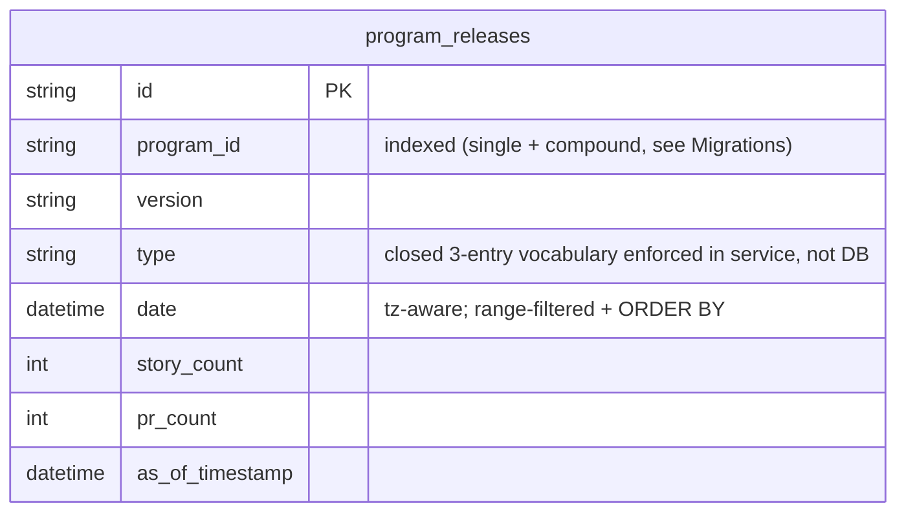

# PGD-03 — Data Design

State & data management. Each concern is specified or marked `N/A — <reason>`.

## 1. Data model

### `program_releases` (postgres table — existing, BED-01, no column change)

| Field | Type | Key/Constraint | Class | Notes |
|---|---|---|---|---|
| id | String | PK, uuid4 default | — | app-generated, matches ingest id convention |
| program_id | String | indexed (`ix_program_releases_program_id`, plus new compound index — see § 2) | — | scopes every query this story adds |
| version | String | — | — | wire: `ver` |
| type | String | — | — | must be one of the closed 3-entry vocabulary at read time (D-03); no CHECK constraint added — enforced in the service layer, not the DB, since BED-01 owns the column and this story does not alter its schema |
| date | DateTime(tz) | — | — | wire: pre-formatted `"Jul 15"`; range-filter + sort column |
| story_count | Integer | — | — | wire: `stories` (as string) |
| pr_count | Integer | — | — | wire: `prs` (as string) |
| as_of_timestamp | DateTime(tz) | — | — | not surfaced on this response |

No new table. No new column. This story is read-only against `program_releases`.

## 2. Migrations

Forward: migration `007_program_releases_date_index.py` (down_revision `006_usage_events_source_credits`)
adds `op.create_index("ix_program_releases_program_id_date", "program_releases", ["program_id", "date"])`
— additive, non-concurrent (matches `002`/`004` precedent; no maintenance-window requirement exists
in this project today). Rollback: `downgrade()` drops exactly that index; symmetric, zero data loss.

No data backfill — an index build reads existing rows, writes no rows. No zero-downtime concern:
the table is currently empty in every environment (§ 10 below), and even at production scale a
plain (non-concurrent) `CREATE INDEX` is the same accepted tradeoff already made for `002`/`004`.

`ProgramReleases.__table_args__` (`app/models/rollup.py`) updated in the same task to declare both
indexes, and `services/api/tests/fixtures/prd_8_4_schema.json` updated to match — required by
`test_migrations.py::TestSchemaDiffGate` (`alembic check` zero-diff) and
`test_models.py::TestFixtureDrivenTableConstraints`, per `alembic-patterns`. See ADR-0015.

## 3. Ownership & tenancy

`program_releases` rows are scoped by `program_id` (no `user_id`/`tenant_id` column — this schema's
tenancy unit is the program, matching every other rollup table). Enforcement mechanism: the
**query-level filter** `WHERE program_id = :program_id` on both the row and count queries (never a
post-fetch filter), plus the server-side `program_visibility(current_user, program_id)` veto gate
(AUTH-03, open-aggregate — passes for any authenticated session, does not gate by program
membership, matching PGD-01/PGD-02's established, intentional design). No RLS policy exists in
this schema; enforcement is entirely in the FastAPI route + service layer, consistent with every
other Program Detail endpoint.

## 4. Data classification & retention

No PII in `program_releases` (version strings, release-kind labels, counts, dates — no user
identifiers). No new encryption-at-rest requirement beyond the database's existing at-rest
posture. Retention: unchanged from BED-01 — rows are bulk-deleted and (in principle) re-inserted
per `rebuild_program_rollups()`'s program-scoped rebuild pass; this story adds no new retention or
deletion logic (read-only).

## 5. Consistency & concurrency

Single-transaction read (one `SELECT` for rows, one `SELECT count(*)` for `relTotal`, no write).
No idempotency key needed — GET is naturally idempotent. **FR-PGD03-6 window-parity requirement**:
both queries MUST share the identical `WHERE program_id = :pid AND date >= :range_start` predicate,
enforced by construction — a single service function builds both queries from one shared
`date`-window value, never two independently-computed windows. No concurrent-write concern: this
endpoint never writes.

## 6. Caching

No cache layer for this endpoint — every request re-queries `program_releases` directly, matching
PGD-01/PGD-02's precedent (no dedicated cache for Program Detail sub-resources; only `session.programs`
carries a TTL cache, per README). `no TTL — no cache` is the answer here, not an oversight.

## 7. Ephemeral / session state

Frontend: the Releases panel's own range switcher (`7d`/`30d`/`90d`, independent of PGD-02's chart
switcher) is client component state (`useState` in `ReleasesList.tsx`, mirroring
`DailyTokenTrendChart.tsx`'s `RangeKey` state) — not persisted to URL, not shared across page
reloads. Pagination (`offset`) state, if the frontend adds a "load more"/paging affordance beyond
the mockup's single-page render, is likewise local component state (out of DESIGN.md's rendered
scope — the mockup shows no pagination control; see PLAN.md § 6 for the frontend's decision to
render only the first page in this iteration, matching what the mockup depicts).

## 8. Query-path & access-path performance

Two query shapes, both `WHERE program_id = :pid AND date >= :range_start`:
1. Row fetch: `... ORDER BY date DESC OFFSET :offset LIMIT :limit` (offset/limit pagination, capped
   at 50 per page — bounded, no unbounded fan-out per `.claude/rules/performance-baseline.md`).
2. Count: `SELECT count(*) ... ` over the same predicate (FR-PGD03-6 parity).

Both are backed by the new compound index (§ 2, ADR-0015) — `EXPLAIN ANALYZE` verification is
PGD-03-TC-20's job at 5000+ rows/program. No N+1: exactly two queries per request, independent of
how many releases exist. Offset pagination (not cursor) is retained here to match
`get_offset_limit`'s existing offset/limit shape used by every other paginated endpoint in this
codebase (`app/api/activities.py`) — introducing cursor pagination for this one endpoint would be
inconsistent with the established convention and is not requested by any FR.

## 9. Contract (API / interface)

Registered cross-story contract — authored in full in `docs/requirements/api.md#program-releases-api`
(`produced_by: PGD-03`, `consumed_by: [ARC-01, DEV-01, PMD-01, EMD-01]`).

Contract: program-releases-api → docs/requirements/api.md#program-releases-api

## 10. Async & messaging

N/A — purely synchronous request/response. No message, event, job, or schedule is produced or
consumed by this story. Note (carried forward, not built here): `program_releases` is currently
never populated by any ingest path — `rebuild_program_rollups()` deletes-and-does-not-reinsert
(BED-03 D-03) and no release-ingestion story exists in the RTM. This endpoint is built against
that eventual producer's contract, but ships now with an empty-in-production data source. See
PLAN.md § 6 for the HIGH risk and carry-forward recommendation.
